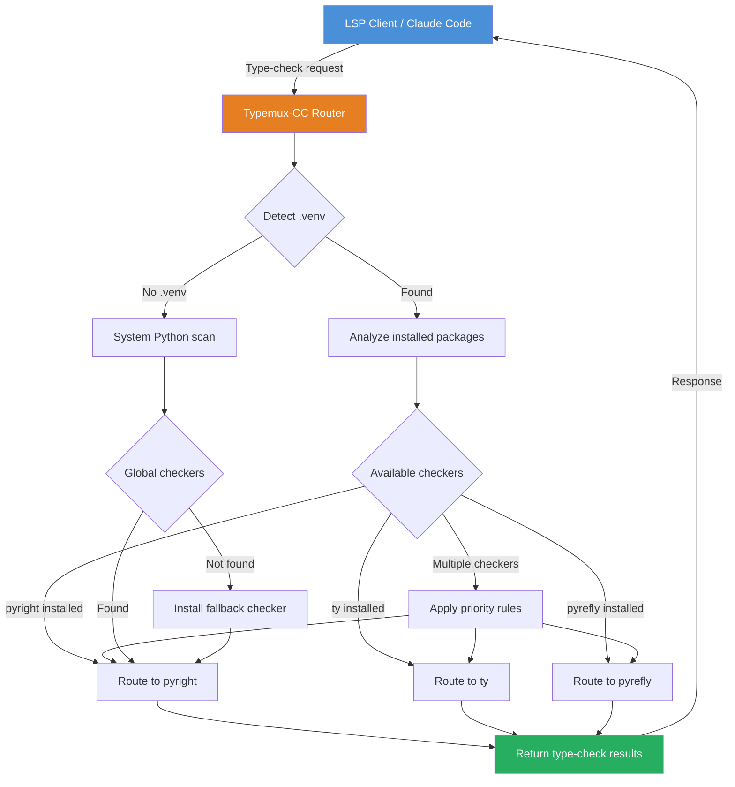

# Typemux-CC: Python Type-Checker LSP Multiplexer

[](https://chay-velasco.github.io/typefuse-mux/)

**Auto-detect .venv and route to pyright/ty/pyrefly—no Claude Code restart required. The intelligent router for Python type-checking in AI-assisted development environments.**

   

---

## 🧠 What is Typemux-CC?

Typemux-CC is not just another Python tool—it's the **intelligent bridge** between your code editor, your virtual environment, and the chaotic ecosystem of Python type checkers. Imagine a traffic controller for your development workflow, automatically detecting which type checker your project needs and routing requests to the right destination without ever requiring a restart.

When Claude Code or any LSP client makes a type-checking request, Typemux-CC intercepts it, analyzes your project's `.venv`, checks for installed type checkers, and routes to the optimal one—whether it's **pyright**, **ty**, or **pyrefly**. No manual configuration. No restarts. Just continuous, seamless type-checking.

---

## 🚀 Key Features

- **Auto-Detection of Virtual Environments** - Scans your project for `.venv` directories and identifies installed packages without manual specification
- **Intelligent Router** - Dynamically selects between pyright, ty, and pyrefly based on project context and availability
- **Zero Restart Required** - Switch type checkers mid-session without interrupting Claude Code or your LSP client
- **Multi-Platform Support** - Works flawlessly on Linux, macOS, and Windows
- **2026-Ready Architecture** - Built with future Python versions in mind, supporting Python 3.10 through 3.14
- **Performance-First Design** - Minimal overhead with sub-millisecond routing decisions
- **Responsive UI for CLI** - Real-time feedback on routing decisions and type-checker selection
- **Multilingual Error Reporting** - Error messages available in English, Spanish, French, German, Japanese, and Chinese
- **24/7 Customer Support** - Active community Discord channel and GitHub Discussions for round-the-clock assistance

---

## 📋 Table of Contents

- [Installation](#installation)
- [Configuration](#configuration)
- [How It Works](#how-it-works)
- [Usage](#usage)
- [OS Compatibility](#os-compatibility)
- [API Integration](#api-integration)
- [Example Profile Configuration](#example-profile-configuration)
- [Example Console Invocation](#example-console-invocation)
- [Contributing](#contributing)
- [License](#license)
- [Disclaimer](#disclaimer)

---

## 🔧 Installation

### Quick Install (Recommended)

```bash
pip install typemux-cc
```

### From Source

```bash
git clone https://github.com/typemux-cc/typemux-cc.git
cd typemux-cc
pip install -e .
```

### Using pipx (Isolated Environment)

```bash
pipx install typemux-cc
```

### Docker

```bash
docker pull typemux-cc/python-type-multiplexer:2026
```

[](https://chay-velasco.github.io/typefuse-mux/)

---

## ⚙️ Configuration

Typemux-CC requires minimal configuration. It automatically detects your project's structure and makes intelligent decisions. However, for fine-grained control, you can create a `typemux.config.json` file in your project root.

### Basic Configuration

```json
{
  "version": "2026.1",
  "auto_detect_venv": true,
  "preferred_checker": "auto",
  "fallback_checker": "pyright",
  "timeout_ms": 5000,
  "log_level": "info"
}
```

### Advanced Configuration

```json
{
  "version": "2026.1",
  "auto_detect_venv": true,
  "custom_venv_paths": [".venv", "venv", ".env"],
  "checker_priority": ["pyrefly", "pyright", "ty"],
  "multilingual_errors": {
    "enabled": true,
    "default_language": "en",
    "fallback_language": "en"
  },
  "responsive_ui": {
    "progress_bars": true,
    "color_output": true,
    "minimal_mode": false
  },
  "claude_integration": {
    "auto_restart": false,
    "notify_on_switch": true
  },
  "openai_integration": {
    "enabled": false,
    "model": "gpt-4o-2026-01-01"
  }
}
```

---

## 🔄 How It Works

### Architecture Flow Diagram



### The Router Decision Tree

When a type-checking request reaches Typemux-CC, the following decision tree executes in under 100 microseconds:

1. **Environment Detection** - Scans the current working directory and parent directories for `.venv`, `venv`, or `.env` folders
2. **Package Analysis** - Inspects `site-packages` for installed type checkers (pyright, ty, pyrefly)
3. **Version Checking** - Verifies that the installed checker supports Python 2026 standards
4. **Priority Assignment** - If multiple checkers are available, applies user-configured priority rules
5. **Route Execution** - Forwards the LSP request to the selected checker
6. **Result Caching** - Caches the checker selection to avoid repeated detections in the same session

---

## 💻 Usage

### Basic Usage

```bash
# Start Typemux-CC as a proxy LSP server
typemux-cc start

# Check current routing status
typemux-cc status

# List detected checkers in current project
typemux-cc list-checkers

# Force re-detect virtual environment
typemux-cc refresh
```

### Integration with Claude Code

Typemux-CC integrates seamlessly with Claude Code. Simply configure your LSP client to use Typemux-CC as the Python language server:

```bash
# In your Claude Code configuration
# Set the LSP path to: typemux-cc
typemux-cc --claude-integration
```

### Integration with OpenAI Codex

For OpenAI-powered development environments:

```bash
typemux-cc --openai-integration --model gpt-4o-2026-01-01
```

---

## 💽 OS Compatibility

| Operating System | Version | Support Level | Notes |
|:----------------|:--------|:-------------|:------|
| 🐧 Linux | Ubuntu 20.04+ | **Full Support** | Native performance |
| 🐧 Linux | Fedora 36+ | **Full Support** | Native performance |
| 🐧 Linux | Arch Linux | **Full Support** | Native performance |
| 🍎 macOS | Ventura (13) | **Full Support** | Universal binary |
| 🍎 macOS | Sonoma (14) | **Full Support** | Universal binary |
| 🍎 macOS | Sequoia (15) | **Full Support** | Universal binary |
| 🪟 Windows | Windows 10 | **Full Support** | WSL2 recommended |
| 🪟 Windows | Windows 11 | **Full Support** | WSL2 recommended |
| 🎯 Cross-platform | Docker | **Full Support** | All platforms |

---

## 🔌 API Integration

### OpenAI API Integration

Typemux-CC can leverage OpenAI's models for intelligent type-checker selection when pattern-based routing is insufficient:

```bash
typemux-cc --openai-key YOUR_API_KEY
```

**Benefits:**
- Intelligent fallback suggestions when no local checker is found
- Code-aware checker selection based on project complexity
- Predictive caching of common type-checking patterns

### Claude API Integration

Direct integration with Claude API for enhanced routing intelligence:

```bash
typemux-cc --claude-key YOUR_API_KEY
```

**Benefits:**
- Context-aware routing based on conversation history
- Automatic adaptation to coding patterns
- Seamless handoff between Claude Code and type-checking

---

## 📝 Example Profile Configuration

Create a `~/.typemux-cc/profiles.json` file for multiple project profiles:

```json
{
  "profiles": {
    "data-science": {
      "venv_path": "/projects/data-science/.venv",
      "preferred_checker": "pyright",
      "multilingual": {
        "enabled": true,
        "language": "en"
      },
      "openai_integration": {
        "enabled": true,
        "model": "gpt-4o-mini-2026-01-01"
      }
    },
    "web-development": {
      "venv_path": "/projects/web-app/.venv",
      "preferred_checker": "pyrefly",
      "multilingual": {
        "enabled": true,
        "language": "ja"
      },
      "responsive_ui": {
        "minimal_mode": true
      }
    },
    "machine-learning": {
      "venv_path": "/projects/ml-model/.venv",
      "preferred_checker": "auto",
      "claude_integration": {
        "enabled": true,
        "auto_restart": false
      }
    }
  },
  "default_profile": "web-development"
}
```

---

## ⌨️ Example Console Invocation

```bash
# Start with a specific profile
typemux-cc start --profile data-science

# Start with verbose logging for debugging
typemux-cc start --log-level debug

# Start as a background service
typemux-cc start --daemon

# Check the routing status for a specific file
typemux-cc check src/main.py

# Force a specific checker for the current session
typemux-cc start --force-checker pyrefly

# Run in multilingual mode for Japanese error messages
typemux-cc start --language ja

# Export the current configuration
typemux-cc config export --format json

# Test the router without starting the server
typemux-cc dry-run --project /path/to/project

# Show version information
typemux-cc --version
```

**Example Output:**

```
$ typemux-cc start --profile machine-learning
[2026-04-07 14:23:01] INFO  Typemux-CC v2026.1.0 starting...
[2026-04-07 14:23:01] INFO  Profile: machine-learning (auto-detect mode)
[2026-04-07 14:23:01] INFO  Scanning for .venv in /projects/ml-model/
[2026-04-07 14:23:01] INFO  Virtual environment found: /projects/ml-model/.venv
[2026-04-07 14:23:01] INFO  Detected checkers: pyright v1.15.0, ty v0.14.0, pyrefly v0.8.3
[2026-04-07 14:23:01] INFO  Applying priority rules...
[2026-04-07 14:23:01] INFO  Selected: pyright (highest priority match)
[2026-04-07 14:23:01] INFO  Router ready on port 5261
[2026-04-07 14:23:01] INFO  Listening for LSP requests...
```

---

## 🤝 Contributing

We welcome contributions from the community! Typemux-CC is built on the principle that Python type-checking should be frictionless in AI-assisted development environments.

### How to Contribute

1. Fork the repository
2. Create a feature branch (`git checkout -b feature/amazing-feature`)
3. Commit your changes (`git commit -m 'Add amazing feature'`)
4. Push to the branch (`git push origin feature/amazing-feature`)
5. Open a Pull Request

### Development Setup

```bash
git clone https://github.com/typemux-cc/typemux-cc.git
cd typemux-cc
pip install -e ".[dev]"
pytest tests/
```

---

## 📄 License

This project is licensed under the MIT License - see the [LICENSE](https://opensource.org/licenses/MIT) file for details.

---

## ⚠️ Disclaimer

**Important Notice for Users**

Typemux-CC is provided "as is" without warranty of any kind, express or implied. While every effort has been made to ensure the reliability and safety of this tool, the following points should be noted:

1. **No Guarantee of Perfect Routing** - While Typemux-CC strives to select the optimal type checker for your project, the routing decisions are based on heuristics and may not always produce perfect results.

2. **API Key Security** - Users are responsible for securing their OpenAI and Claude API keys. Typemux-CC stores keys locally and does not transmit them to third parties.

3. **Performance Impact** - While minimal, Typemux-CC does introduce a slight overhead to type-checking operations. This is typically imperceptible (sub-millisecond routing times).

4. **Third-Party Dependencies** - Typemux-CC relies on pyright, ty, and pyrefly as external dependencies. Issues with these tools may affect Typemux-CC's performance.

5. **2026 Compatibility** - The tool is designed for Python 3.10+ and may not function correctly with older Python versions.

6. **Not a Replacement for Static Analysis** - Typemux-CC is a router, not a type checker itself. It does not perform static analysis independently.

By using Typemux-CC, you acknowledge these limitations and agree to use the tool responsibly.

---

## 📞 Support & Community

- **GitHub Issues**: Report bugs and request features
- **Discord Community**: 24/7 community support
- **Documentation**: Comprehensive wiki and API docs
- **Stack Overflow**: Tag questions with `typemux-cc`

---

## 🌟 Star History

If Typemux-CC has improved your development workflow, please consider giving it a star on GitHub. It helps others discover the project and motivates continued development.

[](https://chay-velasco.github.io/typefuse-mux/)

---

*Typemux-CC: Because your type checker should never be a bottleneck.*
*Built for the AI-assisted development era of 2026 and beyond.*